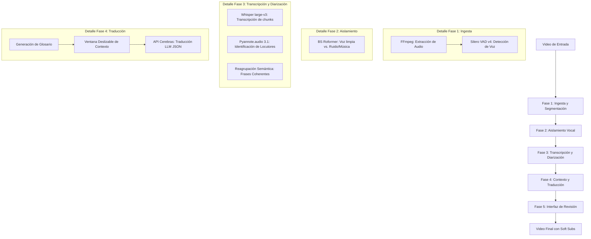

# Pipeline de Procesamiento (MVP)

Este documento detalla la arquitectura del pipeline de procesamiento de **AutoSub-AI** para su versión MVP. El sistema está diseñado en torno al concepto de **Fases Horizontales** con el fin de optimizar el uso de VRAM en entornos de consumo de GPU locales.

---

## Procesamiento Horizontal por Fases

A diferencia de un procesamiento secuencial por archivo (donde un solo video pasa por todas las fases antes de empezar con el siguiente), el pipeline de AutoSub-AI procesa la totalidad del contenido en una fase horizontal antes de liberar los modelos de memoria y cargar los correspondientes a la siguiente fase.

Esto evita la alternancia constante de modelos pesados en la GPU (por ejemplo, descargar BS Roformer para cargar Whisper, y luego volver a cargar BS Roformer para el siguiente video), reduciendo drásticamente los tiempos muertos y el riesgo de errores por falta de memoria (Out of Memory - OOM).

---

## Detalle de las Etapas del MVP

### 1. Ingesta y Segmentación
* **Extracción de Audio (FFmpeg):** El video de entrada se procesa para extraer su flujo de audio. Para asegurar la máxima compatibilidad y optimización, se realiza un remuestreo a mono y una tasa de 16 kHz.
* **Detección de Actividad de Voz (Silero VAD v4):** Se segmenta el flujo de audio continuo para detectar los intervalos de tiempo exactos donde hay habla humana. 
  * *Nota de Arquitectura:* En el modo recomendado (alta VRAM), BS Roformer integra Silero VAD internamente para optimizar el aislamiento. Sin embargo, el pipeline mantiene este paso conceptualmente aislado para soportar perfiles de VRAM media/baja en el futuro.

### 2. Aislamiento Vocal
* **Aislamiento (BS Roformer):** Los fragmentos de audio identificados con voz se procesan a través de BS Roformer. Este modelo separa de forma quirúrgica la voz de cualquier sonido de fondo (música, ruidos incidentales, efectos sonoros), enviando audios de voz limpios al transcriptor. Esto reduce a un nivel mínimo las alucinaciones típicas de Whisper en secciones con ruido o música.

### 3. Transcripción y Diarización
* **Transcripción (Whisper large-v3):** Se procesan los chunks de audio limpios utilizando el modelo predeterminado `large-v3`.
* **Diarización (Pyannote.audio 3.1):** De forma paralela o consecutiva, se procesa el audio para asociar cada rango de tiempo con una etiqueta de locutor (ej. `Locutor_1`, `Locutor_2`).
* **Reagrupación Semántica:** Las palabras transcritas se reagrupan ignorando los cortes del VAD, guiándose por signos de puntuación y entonación para formar oraciones semánticamente completas que permitan al traductor entender el contexto.

### 4. Contexto y Traducción
* **Glosario Inicial:** El pipeline realiza una lectura rápida para extraer nombres propios y términos clave, consolidando un glosario JSON.
* **Traducción mediante Ventana Deslizable (Cerebras API):**
  - Los subtítulos se traducen en bloques (ej. 30-50 líneas).
  - Cada petición incluye el contexto de las últimas líneas del bloque anterior.
  - La inferencia se realiza mediante la API de **Cerebras** para obtener traducciones instantáneas de alta calidad.
  - Se obliga al modelo a responder en un esquema JSON estructurado para emparejar el texto traducido con sus marcas de tiempo originales de forma segura.

### 5. Ensamblado Final
* **Muxing de Subtítulos (FFmpeg):** Los textos traducidos y alineados temporalmente se compilan en un archivo `.srt` o `.vtt`. Posteriormente, se inyectan en el video de origen como pistas seleccionables (Soft Subs) sin alterar la calidad del video original.
